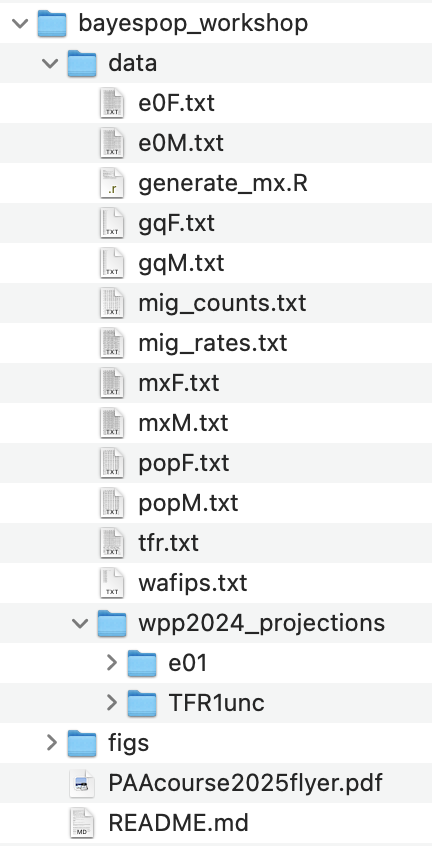

# PAA 2025 Workshop on Subnational Probabilistic Population Projections 

**Westin Washington D.C. Downtown, Meeting Room 2**<br/>
**4/10/2025, 8am - 5pm**

In this workshop, we will generate probabilistic population projections for all counties of Washington state, including probabilistic projections of the individual components of population change, such as the total fertility rate, life expectancy at birth and net migration.

## Pre-requisites

### Software
The projections are generated using the programming language [R](https://cran.r-project.org). The most convenient way to work with R is from  the [RStudio Desktop](https://www.rstudio.com/products/rstudio/download). Basic familiarity with R is recommended.

To install packages needed in this workshop, open your R application and type

```{r eval=FALSE}
install.packages(c("bayesTFR", "bayesLife", "bayesPop", 
        "MortCast", "bayesMig", "devtools"), dependencies = TRUE)
```

The latest UN projections (WPP 2024) are available in the [wpp2024](https://github.com/PPgp/wpp2024) R package. One can install it via:

```{r eval=FALSE}
options(timeout = 600)
devtools::install_github("PPgp/wpp2024")
```

Check that you have the latest versions installed, for example by typing

```{r eval=FALSE}
library(bayesPop)
library(wpp2024)
sessionInfo()
```
You should see versions of the above packages. Check that they are as follows:

```
wpp2024_1.1-3  bayesPop_11.0-2   MortCast_2.8-0   bayesLife_5.3-1   
bayesTFR_7.4-4 
```

### Data
The subnational datasets needed in this demo are available in the `data` directory of this repository. Note that these datasets do not represent any official metrics. Some of them were synthetically created and their only purpose is to illustrate the methodology. 

Clone this repository to your computer, for example from the command line via

```
git clone https://github.com/PPgp/PAA2025workshop bayespop_workshop
```

Alternatively, one can clone it directly from an R Studio via File -> New Project -> Version Control -> Git. As repository URL enter https://github.com/PPgp/PAA2025workshop and as Project directory name enter bayespop_workshop. Then click on "Create Project".

Both of these alternatives create a directory "bayespop_workshop" which will be your working directory for this workshop. It contains the subdirectory "data" with the subnational datasets.

For projecting the total fertility rate and life expectancy at birth (e0), national probabilistic projections are needed and they should be placed into the subdirectory "data/wpp2024\_projections". They could be generated from scratch, but to save time, please download them from our [website](https://bayespop.csss.washington.edu/data) as follows:

1. Download the [TFR](https://bayespop.csss.washington.edu/data/bayesTFR/TFR1simWPP2024.tgz) compressed file and unpack it (e.g. using 7-Zip or WinZip on Windows or "tar xvfz" on Unix-based systems) into the "bayespop_workshop/data/wpp2024\_projections" directory. It creates a subdirectory called "TFR1unc".
2. Repeat the same with the [e0](https://bayespop.csss.washington.edu/data/bayesLife/e01simWPP2024.tgz) file. It creates a subdirectory called "e01".

<!--After these steps, your "bayespop\_workshop" directory should look like this:

-->

## Workshop Material

Link to be added soon.
